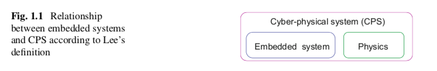
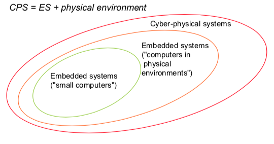
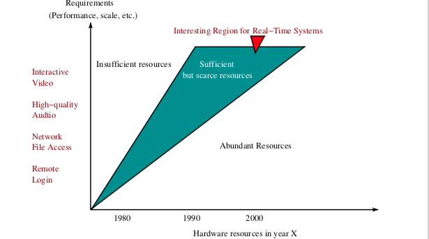

ES Zusammenfassung
##################

Table Of Contents
#################

* Filme_
* Kapitel_1_

.. _Filme:

Filmvortraege
#############

Crash des Flugzeugs
===================

* Integer Overflow 64 zu 16 bit

Zu Realtime Constraints
=======================

vehicle networks (UoNY)
-----------------------

* engine management etc. ware sehr teuer
* Loesung: Bus/ **Wiring Harness**
* **Can Messages**: Bitstrings mit binaeren informationen zu Oel Temperaturen etc.
    + fast processing

ICU -> Can message -> decoding Can Message -> performing analog task

Real-Time communication (runtime UoNY)
--------------------------------------

* determining Time problematic
    + Worst case execution time problem
        - constants of the O-Notation matter (cache miss/ empty cache etc.)
        - Speed des Prozessors mit beruecksichtigen
* end-to-end meassurements
    + underestimate worst case
    + **not safe**!!
* static analysis
    + modelling the timing behaviour of the processor
    + performing worst case
    + exact order problematic
        - running binary instead of source code, **not working** correctly
* keiner der Ansaetze gut genug 

.. _Kapitel_1:

Kapitel 1 Introduction
######################

History of Terms
================

Definitionen
------------

Zu ES
^^^^^

* Marwedel
    + Embedded systems are information processing systems embedded into
      enclosing products.
* VL
    + Embedded systems are information processing systems *embedded* into a 
      larger product

Also Systeme, die Information verarbeiten und in ein groesseres Produkt 
"eingebettet"  sind. 

|

Anders:

ES sind systeme, die Software bereit stellen, die durch die Verarbeitung von 
Sensor Signalen/ Physikalischen Prozessen
ein Physikalisches/ Reelles Product um Features/ Verbesserungen ergaenzt.

Dabei ist insbesondere das Management von Zeit und Concurenxy im system wichtig.

Zu CPS
^^^^^^

* VL/ Buch
    + Cyber-Physical Systems are integrations of computation with physical 
      processes

Also: :math:`CPS = ES + physics`

Bzw.: Es muss die Physikalische Umgebung mit beruecksichtigt werden

Opportunities
=============

Die Verarbeitung von Informationen im Kontext von CPS oder dem 
IoT(Internet of Things) findet unter anderem Anwedung in den Folgenden Gebieten:

* Transport
    + Automobilelektronik
        - ABS, ESP, GPS etc.
    + Flugzeug/ avionics
        - flight control
        - anti collision
        - pilot information
        - power supply
        - flap control
        - entertainment
        - autopilot
    + Zug/ railroad
        - safety features
        - ETCS (The European Train Contral System)
    + Schiffe/ water ways
        - Navigation
        - safety
        - Buchhaltung
* Logistics
    + RFID (Radio frequency identification)
    + Mobile communication
    + energy minimization
* Fabrication/ Factory automation
    + social machines (self configuration/ distribution)
* Structural Safety
    + Regulation des Wasserstandes eines Damms
    + Ueberwachung von Bruecken/ Vilkanen
    + Neigung von Hochhausern bei Erdbeben
* Smart Home
    + zero energy buildings
    + safety/ security
    + comfort
    + ambient assited living (selbst regulierende Fenster etc.)
* Physical/ Science Experiments
    + obeservation of outcomes
* Telecommunication
* Consumer electronics
* Robotics
* Public safety
* Military Systems

|

Es besteht die Moeglichkeit vorher isolierte Systeme nun zu verbinden.

Challenges
==========

Dependability
-------------

Systeme keonnen auf mehreren Rechnern gleichzeitig laufen, fuer den Fall, dass
Fehler auftreten

Zur Dependability gehoeren:

* Reliability :math:`R(t)`
    + Wahrscheinlichkeit, dass das System funktioniert, wenn es 
      zu Begin (:math:`t=0`) funktionierte
* Maintainability :math:`M(d)`
    + Wahrscheinlichkeit, dass das System d Zeiteinheiten nach einem Error
      funktioniert
* Availability :math:`A(t)`
    + Wahrscheinlichkeit, dass das System zum Zeitpunkt t funktioniert
* Safety
    + Kein Schaden kann entstehen
    + Oder z.B.: Keine Software-Malfunction sollte Menschenleben gefaehrden 
      koennen
* Security
    + vertrauuche und authentische Kommunikation
    + Sicherung gegen Attacken von Ausserhalb auf das System

Efficiency
----------

CPS und ES effizient funktionieren, dazu gehoeren:

* Codesize
    + small memories
    + powerconsumpotion groesser bei groesserem Speicher
* Run-time
* Weight
    + weight of the chip/ computer
* Cost
* Energy
    + siehe code-size

|

zur Graphic:

* ASIC am effizientesten und **Teuersten**
* FPGA aehnlich zu ASIC
    + etwas mehr Freiraum
* RISC MPU sehr ineffizient
    + aber **flexibel**

.. image:: ../../../Modules/ES/energy_efficiency.png

Hardware
--------

* Sensoren entnehmen Informationen aus dem Physikalischen Umfeld
* Analog to Digital converter (**A/D converter**)
    + stabile Translation Sensor -> digital
* actualor funktioniert analog
    + D/A converter noetig

Real-Time constraints
---------------------

*A real-time constraint is called hard, if not meeting that constraint could 
result in a catastrophe*

* alle constriants sind soft
* predictable and reliable computing not neccessarily fast
* faster processor -> timeliness violation

|

Nicht alle ES brauchen Real-Time effizienz, CPS schon.
Daher :math:`RTS \overset{~}{=} CPS`

Reactive & hybrid systems
-------------------------

reactive system
^^^^^^^^^^^^^^^

*A reactive system is (one which is) in continual interaction with its 
environment and executes at a pace determined by that environment*

* demnach sind ES und CPS reactive systems
    + input und state beeinflussen das Verhalten
* Automaten Modell eignet sich

hybrid system
^^^^^^^^^^^^^

analog und digitale teile

* Beispiel manche digitaluhren

Space of Design
---------------

Walls
-----

Es muss Wissen von vielen Bereichen verbunden Werden, *Mauern der 
Wissenschaftlichen Disziplinen mussen zum Fall gebracht werden.*
* CS
* EE
* ME
* Physics
* Medicine
* Statistics
* Biology

Software Challenges
-------------------

* dynamic environment
* capturing required behaviour
* validate specifications
* *efficient* translation of specifications into implementations
* meeting real-time constraints
* validating embedded real-time software

..  -  end

Common Charecteristics
======================

Curriculum Integration of ES
============================

Design Flows
============

Problems
========

.. 2.2. 3 - end
